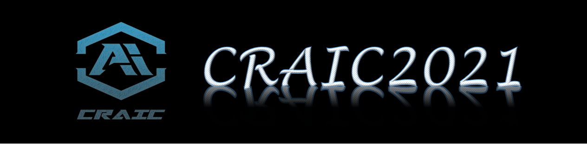
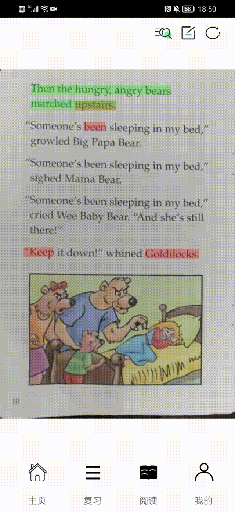

    
    
    
    
    
    

<h1 align="center">
    伴读AI (CRAI)
</h1>
<h4 align="center">
    基于AI视觉和交互的智能伴读辅助学习平台 
    🥈<i>第23届中国机器人及人工智能大赛国家级二等奖</i>
</h4> 

## 🚩  项目简介

**伴读AI**项目以人机交互为核心，聚焦于探索人工智能新技术在现代化阅读中的应用，并基于计算机视觉技术，研究阅读场景中的**人机交互**与**智能辅助阅读**技术。项目包含***手-文混合目标检测***、***场景文本图像超分辨率***等多个方面的算法创新，基于所创新的算法实现了流畅与准确的辅助阅读，提高了阅读学习效率。项目进一步通过开发移动端平台，提供复习与二次学习等个性化功能。

## 🔑  相关技术

- [x] 手部检测
- [x] 手部关键点检测
- [x] 端到端文本检测与识别
- [x] 场景文字图像超分辨率
- [x] 图像匹配
- [ ] 语音合成
- [ ] ...

## 🔍  基本功能演示

### 📖  点读与标记

|  |
| :-------------------------------------: |

### 📲  学习渲染

|  |  |
| :----------------------------------------------------------: | :----------------------------------------------------------: |
|                        学习渲染与点读                        |                        自定义笔记渲染                        |

## 🎯  相关成果

### 📄  科研论文

- ICFTIC2022：[Degradation Prior Guided Scene Text Image Super-Resolution](https://ieeexplore.ieee.org/abstract/document/10075240/)
- ICRCV2022： [HTD: A Fast Human-centered Text-locating Method for Auxiliary Reading](https://ieeexplore.ieee.org/abstract/document/9953262/)
- MIS：[RWYI: Reading What You Are Interested in with a Learning-Based Text Interactive System](https://www.hindawi.com/journals/misy/2022/6378011/)

### 📑  软著及专利

- 伴读AI情景在线信息显示系统V1.0
- ...

## 🔗  联系我们

如果您对我们的工作感兴趣，欢迎联系与交流。（@E-mail：yfaqh2018@163.com）

